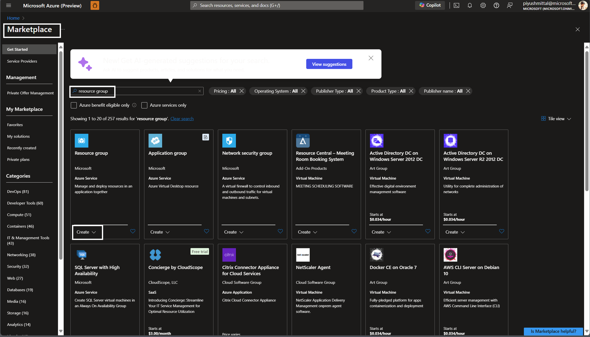
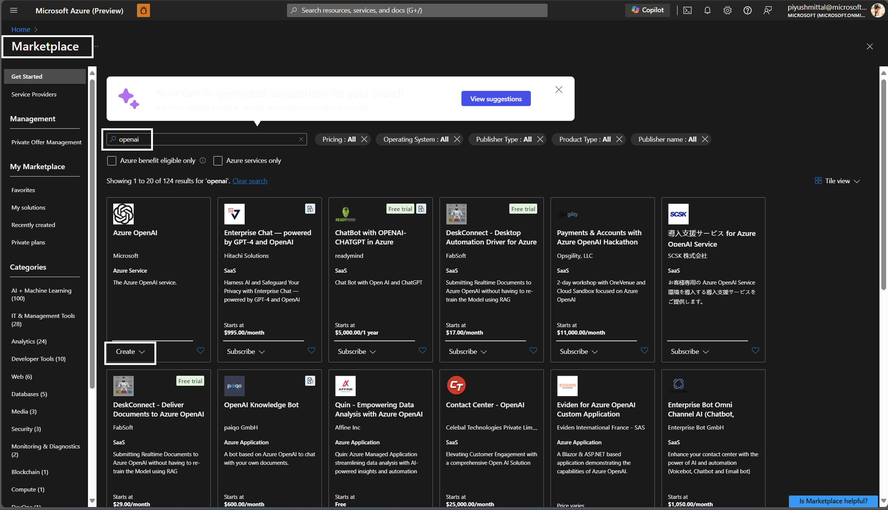
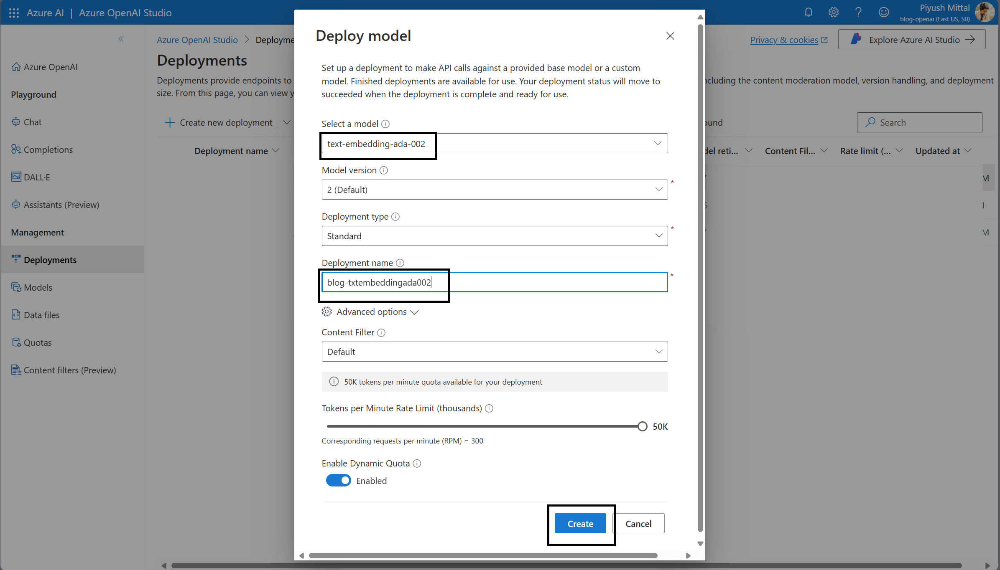
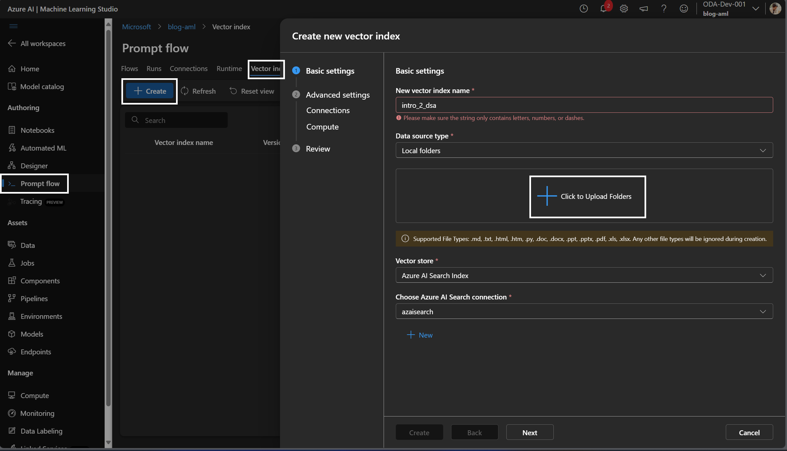
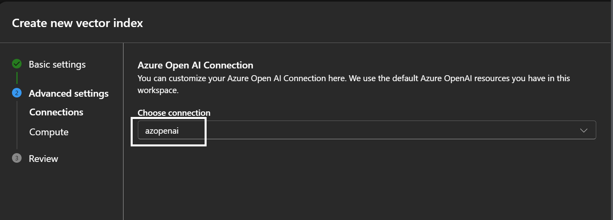
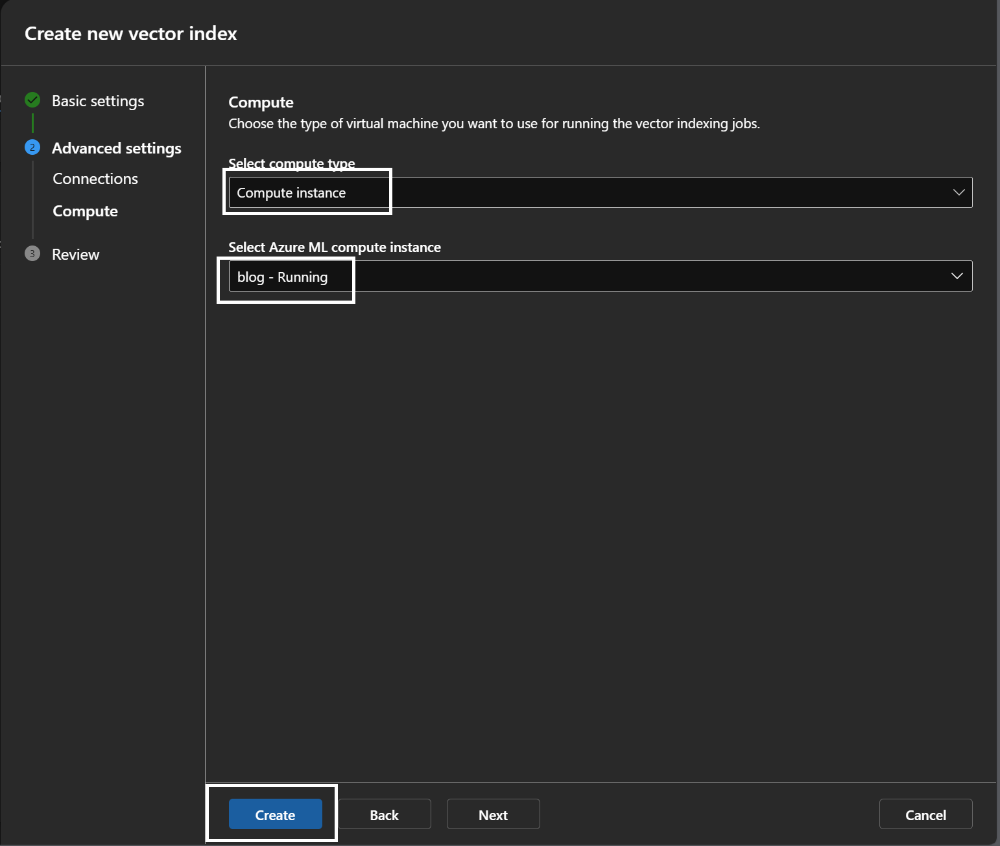
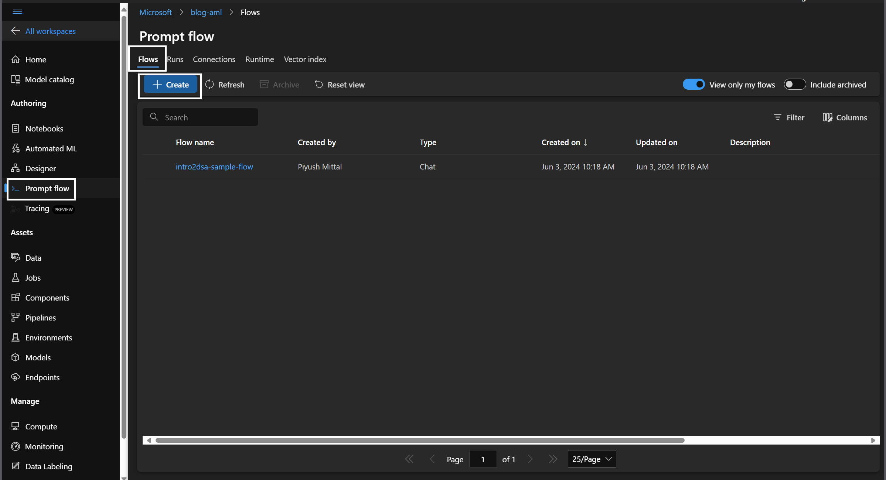
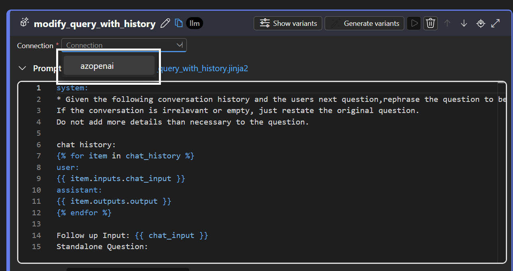
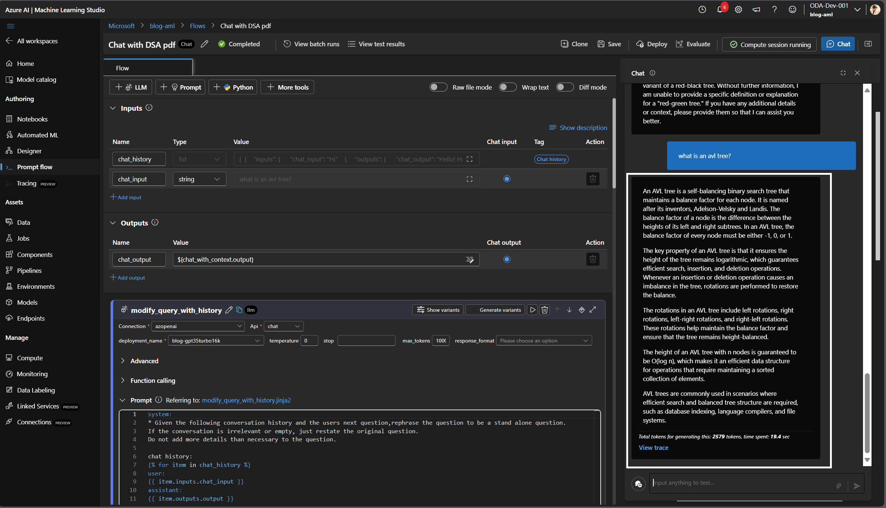

## Introduction:  
In today's digital era, chatbots have become an essential tool for businesses, enabling them to offer instant customer service and enhance user engagement. However, building a chatbot that can interact intelligently with users based on a diverse range of text data formats (such as HTML, TXT, PDF, etc.) can be a daunting task. Fortunately, Azure provides a suite of powerful AI services that simplify this process.

In this blog, we will walk you through the steps of creating a versatile chatbot using Azure. This chatbot will be capable of processing any text data you provide, converting it into a format that it can understand, and using that data to engage in meaningful interactions. We'll leverage Azure's Cognitive Services to extract and analyze text from various formats and store this processed information in a vector database. By the end of this guide, you will have a fully functional chatbot that can interact with users based on the text data you've provided, making use of cutting-edge AI technologies provided by Azure.

Let’s dive in and explore how you can harness the power of Azure to build a sophisticated, intelligent chatbot capable of handling a wide array of text inputs.

## Prerequisite: 
1. Azure Subscription 
2. Resource Group
3. GPT3.5 or 4 Access
4. Cognitive Search Service (aka. Azure AI Search)
5. Azure Machine Learning Service
6. Compute

## Setup to create Azure Machine Learning Prompt Flow: 
1. Create Resource Group  
2. Create Azure ML Resource  
3. Create Azure AI Resource  
4. Create Model Deployments  
5. Create a Compute Instance  
6. Azure Open AI  
7. Cognitive Search   
8. Azure ML Pipeline  
9. Create Prompt Flow  
10. Generate Prompt Text  
11. Deploy  
12. Testing  
   
## Step1: Create Resource Group
1.1 On the Azure Portal homepage, locate and click on the Marketplace section in the left-hand navigation pane.  
1.2 In the Marketplace, use the search bar to type "resource group".  
1.3 Press Enter to perform the search.  
1.4 From the search results, locate the Resource group option listed as an Azure Service by Microsoft.  
1.5 Click on the Create button located under the Resource group option.  
1.6 Choose the Azure subscription under which you want to create the resource group.  
1.7 Enter a unique name for your resource group.  
1.8 Select the appropriate Azure region where you want the resource group to be located.  
1.9 Click the Review + create button.  


I have created resource group named ```blog-rg```  
after successful resource creation you would see your resource group created as given below:  


## Step2: Create Azure AI Resource
Follow the steps mentioned from 1.1 till 1.9 (search for "Azure AI Search")


I have created resource group named ```blog-rg``` 
after successful resource creation you would see your resource group created as given in below reference image:


I have created resource group named ```blog-ai-search```  
after successful resource creation you would see your resource group created as given below: 


## Step3: Create Azure ML Resource
Follow the steps mentioned from 1.1 till 1.9 (search for "Azure Azure Machine Learning") and create Azure Machine Learning resource.


I have created resource group named ```blog-aml```  
after successful resource creation you would see your resource group created as given below: 


## Step4: Create Model Deployments 
Follow the steps mentioned from 1.1 till 1.9 (search for "Azure OpenAI") and create Azure OpenAI resource.


I have created an Azure OpenAI resource named ```blog-openai```  
after successful resource creation you would see your resource group created as given below: 

Once resource created click on "Go to Azure OpenAI Studio" 


Once Click you will redirect to "Azure OpenAI Studio" landing page.
Once land to "Azure OpenAI Studio" Click on "Deployments" and "Create new deployment"


Now select and deploy "gpt-35-turbo-16k" model and click "create".


Again repeat similar step to "Create new deployment" to deploy "text-embedding-ada-002" model.

Select "text-embedding-ada-002" model


Once deployed, you will see two deployment one for gpt-35-turbo-16k and another one for "text-embedding-ada-002" as below


## Step5: Create a Compute Instance 
Click on the resource group create in our example it is "blog-rg". locate "blog-aml" in resources and click.

Once resource "Azure Machine Learning" resource is open, click on "Launch Studio".

Once redirected to "Azure Machine Learning Studio" click on Asset "Compute" and create new "Compute instance". refer below image for reference:

Enter "Compute name" and click on "Review + Create" 


Once compute instance is created, you would see instance name with state as "running" 


## Step6: Azure Open AI 
Once Compute Instance is created, Click on "Prompt flow", "Connections" tab and Create "Azure Open AI" connection.

Provide required inputs in Azure OpenAI connection as mentioned in below refernce image and click on save button.

Once connection is saved, you would see a new Azure OpenAI connection you have created


## Step7: Cognitive Search 
Once Azure OpenAI connection is created, create another Azure AI Search connection.

Provide the required input as below.

Once details are provided click on save button


## Step8: Azure ML Pipeline
Click on "Prompt flow" then "Vector Index" tax and Create vector index.

Click to Upload Folders and upload folders having suppoerted files. Choose appropriate "Vector store" and "AI Search connection" and click on "Next"

Provide Azure Open AI Connection

Provide Compute details and Click on Create.

Once Click on Create, you would see vector index creating status as Running

Once Vector index creation is done, Status would be updated from Running to Completed


## Step9: Create Prompt Flow
Now click on "Prompt flow" then "Flows" and click on "Create"

Choose "Multi-Round Q&A on YourData" and click on "Clone". Provide Folder Name and Click on "Clone"

Once Clicked on Clone, you will be redirected to Flows.

Now locate "modify_query_with_history", choose "Connection" as the connection you have created

Choose deployment name as the deployment name you have already created.

Now locate "lookup" and locate "mlindex_content" and click on to update this value

Choose index_type, mlindex_asset_id and click on "Save"

Locate "chat_with_context"  and update Connection and deployment_name.


## Step12: Testing
Now we can test the chat bot
Click on ```Chat``` button on top right most corner and write your question. Tap arrow icon 


Chatbot will answer question based on the vector database created from PDF we have uploaded.

