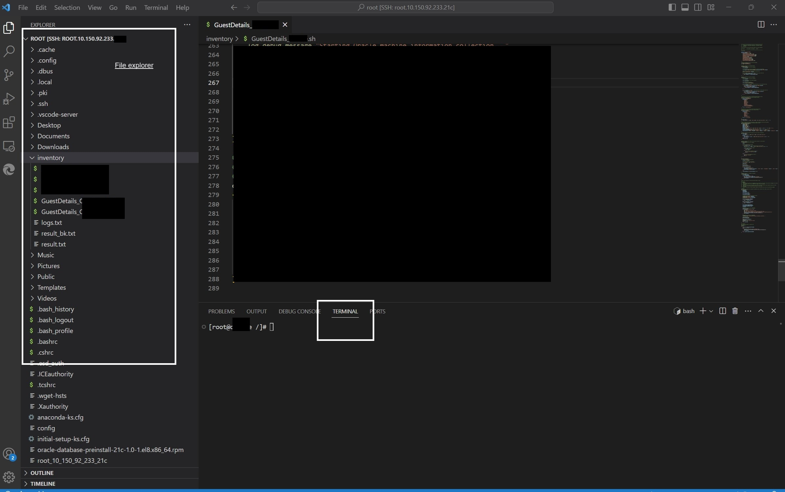

## Introduction:  
If you're using Visual Studio Code and the SSH extension to connect to a Linux machine using public and private keys, here's how you can set it up:


1. **Generate SSH Key Pair** (if you haven't already):

Use the ssh-keygen command on your Windows machine to generate an SSH key pair. Open a terminal (e.g., PowerShell) and run:  

```
ssh-keygen -t rsa -b 4096 -C "your_email@example.com"
Replace "your_email@example.com" with your email address. This command will generate a public key (id_rsa.pub) and a private key (id_rsa) in your user's .ssh directory (usually C:\Users\YourUsername\.ssh).
```

note: email id can be anything.

Replace **"your_email@example.com"** with your email address. This command will generate a public key (**id_rsa.pub**) and a private key (**id_rsa**) in your user's **.ssh** directory (usually **C:\Users\YourUsername\.ssh**).


2. **Copy the Public Key to the Linux Server:**

As mentioned earlier, you'll need to copy the contents of your Windows machine's public key (**id_rsa.pub**) to the **~/.ssh/authorized_keys** file on your Linux server.


please provide below permission also (required in case not using root user)
```
mkdir -p ~/.ssh
chmod 700 ~/.ssh
echo "YOUR_PUBLIC_KEY" >> ~/.ssh/authorized_keys
chmod 600 ~/.ssh/authorized_keys
```

3. **Configure Visual Studio Code:**

* Install the "Remote - SSH" extension for Visual Studio Code if you haven't already.
* Open Visual Studio Code.
* Click on the "Remote Explorer" icon in the sidebar (it looks like a little green alien head).
* At the top of the Remote Explorer panel, click the "SSH TARGETS" button, then click the "Configure SSH Hosts" option.
* In the **~/.ssh/config** file that opens, add an entry for your Linux server. Replace **YourServerName**, **YourServerHostName**, **YourUsername**, and **YourPrivateKeyPath** with the appropriate values:

```
Host YourServerName
    HostName YourServerHostName
    User YourUsername
    IdentityFile YourPrivateKeyPath
```


* Save the config file.


4. **Connect to the Linux Server:**

* In the Remote Explorer panel, you should now see your server listed under "SSH TARGETS."
* Click on your server's name to connect. Visual Studio Code will use the SSH key and configuration you provided to establish the connection.
* You may be prompted to enter your SSH key's passphrase if you set one during key generation.
* Once connected, you can work with your Linux server directly within Visual Studio Code.



That's it! You should now be able to connect to your Linux server from Visual Studio Code using the SSH extension and your SSH key pair.

Trouble shoot guide: 
please check and provide below permission in case you are not able to connect to server or getting enter password prompt
```
mkdir -p ~/.ssh
chmod 700 ~/.ssh
echo "YOUR_PUBLIC_KEY" >> ~/.ssh/authorized_keys
chmod 600 ~/.ssh/authorized_keys
```
