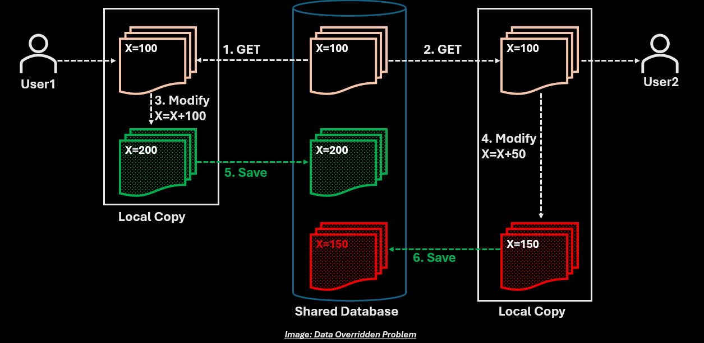
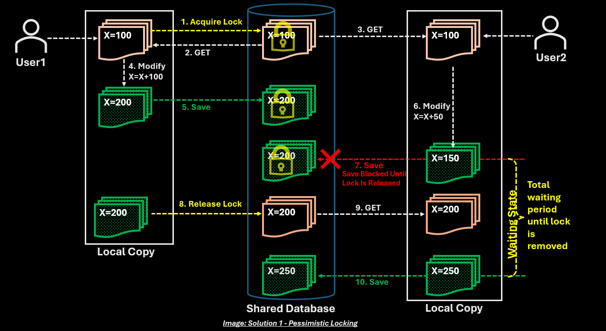
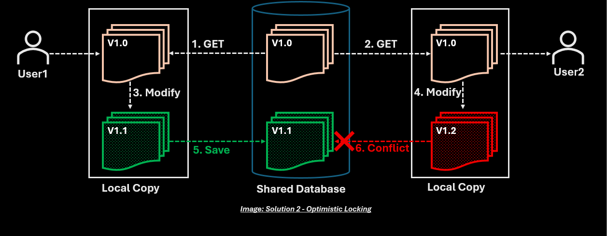

# What Happens If Two Users Update the Same Record?

Imagine two users editing the same data simultaneously.

**User1** opens a profile and starts editing.

At the same time, **User2** opens the same profile from another browser.

Both make changes and click **Save**.

What should happen?

```text
User1                  User2
  ↓                      ↓
1. GET                2. GET
  ↓                      ↓
Modify                Modify
  ↓                      ↓
Save                  Save
```

Both requests arrive at the server almost simultaneously.

This is known as a **Concurrent Update Problem**.

## The Problem



Suppose the current record looks like this:

```json
{
  "value": 100
}
```

### User1

Reads the record.

```json
{
  "value": 100
}
```

Modifies value to 200.

```json
{
  "value": 200
}
```

Clicks Save.

Database now contains:

```json
{
  "value": 200
}
```

---

### User2

Had already read the same record earlier.

```json
{
  "value": 100
}
```

Modifies value to 150.

```json
{
  "value": 150
}
```

Clicks Save.

Database now contains:

```json
{
  "value": 150  ← User1's change (200) is lost!
}
```

Here is the full flow side by side:

```text
User1                      User2
  ↓                          ↓
GET → 100                GET → 100
  ↓                          ↓
Modify → 200             Modify → 150
  ↓                          ↓
Save → DB = 200          Save → DB = 150
                              ↓
                  User1's update (200) lost ❌
```

**User1's update is silently overridden by User2.**

This is called a **Lost Update Problem** or **Data Override Problem**.

## Solution 1: Pessimistic Locking



One solution is to lock the record while a user is editing it.

### How It Works

```text
User1
    ↓
1. GET + Acquire Lock
    ↓
2. Modify locally
    ↓
3. Save
    ↓
Release Lock
```

Meanwhile, User2:

```text
User2
    ↓
Tries to GET
    ↓
Record Locked ❌
    ↓
Wait...
```

This guarantees consistency by preventing concurrent modifications.

However, it creates problems:

* **Long waits** - User2 must wait until User1 finishes
* **Poor user experience** - Editing feels slow and blocked
* **Reduced scalability** - Database resources are held longer
* **Deadlock risk** - Multiple users locking multiple records

Imagine locking a profile for several minutes while someone edits it.

Not practical for web applications.

## Solution 2: Optimistic Locking



Most modern applications use **Optimistic Locking**.

Instead of locking the record, we assume conflicts are rare.

The system stores a version number with each record.

### How It Works

Initial database state:

```json
{
  "value": 100,
  "version": "V1.0"
}
```

---

**Step 1 & 2: Both Users GET the Record**

**User1** performs GET:
- Receives Version **V1.0** from Shared Database
- Creates Local Copy with V1.0

**User2** performs GET:
- Receives Version **V1.0** from Shared Database
- Creates Local Copy with V1.0

Both start editing without any locks.

---

**Step 3 & 4: Both Users Modify Locally**

**User1** modifies value to 150:
- Local Copy now shows **V1.1**
- Database still has V1.0

**User2** modifies value to 200:
- Local Copy now shows **V1.2**
- Database still has V1.0

---

**Step 5: User1 Saves First** ✅

User1 sends Save request with:
```json
{
  "value": 150,
  "version": "V1.0"  ← Version when read
}
```

Database checks:

```text
Shared Database Version = V1.0 ✓
Request Version         = V1.0 ✓
Match!
```

Shared Database updates to:

```json
{
  "value": 150,
  "version": "V1.1"  ← Incremented
}
```

**Success** - User1's change is saved.

---

**Step 6: User2 Tries to Save** ❌ **Conflict Detected**

User2 sends Save request with:
```json
{
  "value": 200,
  "version": "V1.0"  ← Original version when read
}
```

Database checks:

```text
Shared Database Version = V1.1 (changed by User1)
Request Version         = V1.0
Mismatch! ❌
```

Update **rejected**.

```text
❌ 6. Conflict
```

Here is the full flow side by side:

```text
User1                          User2
  ↓                              ↓
GET → V1.0                   GET → V1.0
  ↓                              ↓
Modify → 150                 Modify → 200
  ↓                              ↓
Save (V1.0)                  Save (V1.0)
  ↓                              ↓
DB = 150, V1.1 ✓             Version mismatch!
                          (DB is V1.1, not V1.0)
                                 ↓
                             Conflict ❌
                            Refresh & retry
```

The application tells User2:

> ⚠️ **Conflict Detected**
> 
> This record has been modified by someone else since you last viewed it.
> 
> Current Version: V1.1
> Your Version: V1.0
> 
> Please refresh and try again.

**No data is lost** - User2 must refresh to see User1's change (value = 150, version = V1.1), then decide whether to reapply their changes.

## How It Works Internally

Instead of a simple update:

```sql
UPDATE Records
SET Value = 200;
```

The database executes a **conditional update**:

```sql
UPDATE Records
SET Value = 200,
    Version = 'V1.1'
WHERE Version = 'V1.0';  ← Only update if version matches
```

If the WHERE clause doesn't match (version already changed):

```text
Rows affected: 0
      ↓
Version Conflict Detected
      ↓
Return 409 Conflict to User2
```

The application knows another user already modified the record and can notify User2 appropriately.


## Why Not Always Lock?

Imagine thousands of users updating records simultaneously.

Locks can create:

```text
Waiting
      ↓
Blocking
      ↓
Reduced Throughput
```

Optimistic locking avoids these problems by detecting conflicts only when they occur.

## Key Takeaway

When two users update the same record, one update can accidentally overwrite the other.

Without protection:

```text
Last Writer Wins
```

and valuable data may be lost.

Modern systems solve this using **Optimistic Locking**, where each record carries a version number.

If the version has changed since the user last read the data:

```text
Reject Update
      ↓
Ask User to Refresh
```

This simple technique prevents lost updates while allowing systems to remain scalable.

The next time you update your profile and see:

> "This record has been modified by another user."

you're seeing Optimistic Locking in action.
